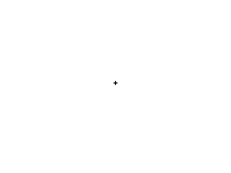
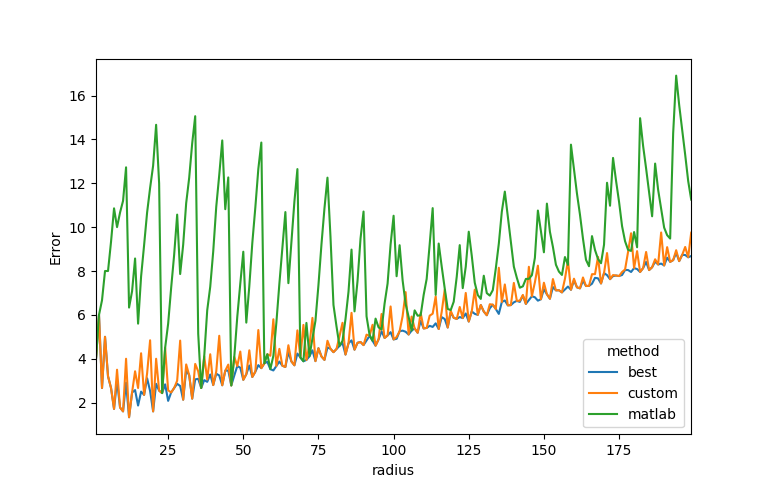

Disc
====

.. doxygenclass:: mln::se::disc
   :members:

Approximated discs
------------------

.. rubric:: Quality of the approximation

The approximated disc 𝔇ₐ of the true euclidean disc 𝔇 uses a radial
decomposition in 8 periodic lines :math:`k_i.L_\theta`
of orientations θ ∈ \{0°, 30°, 45°, 60°, 90°, 120°, 135°, 150°\} and length kᵢ.

Such approximation introduces an error:

.. math::

   err = \frac{|\mathcal{D} \Delta \mathcal{D}_a|}{r}

Below is the error of our approximation, the 8-approximation of matlab and the
best approximation possible using 8 periodic lines (computed by exhaustive
search).

.. table::
   :widths: 33 33 33

   +---------------------+---------------------------+-------------------------+
   | |euc|               |   |matlab|                |   |approx|              |
   +---------------------+---------------------------+-------------------------+
   |   Euclidean disc    | Matlab 8-appoximated disc |  Our appoximated disc   |
   +---------------------+---------------------------+-------------------------+

   Error of our disc approximation (labeled custom above), matlab approximation
   and the best appromximation relative to the euclidean disc.

.. rubric:: Performance

Using approximated disc can speed up the running of some morphological
operations. Below is the running time of the *dilation* by the euclidean disc
*vs* the approximated disc.

.. plot::
   :width: 100%

   from pyplots import plotbysize
   plotbysize("disc_dilation.json")

Dilation by a square is given as reference. The running time of the dilation by
the approximated disc does not depend on the radius (like for a square) because
it uses a decomposition in periodic lines (the SE is decomposable) [Adam93]_
[JoSo96a]_ [JoSo96b]_. The dilation by the euclidean disc is :math:`O(r.n)`
because of the optimization of incremental SEs by [VaTa96]_. It contrasts with
the naive implementation which is :math:`O(r^2.n)` for disc.

References
----------

.. [Adam93] Adams, R. (1993), ‘Radial decomposition of discs and spheres.’, Computer
            Vision, Graphics, and Image Processing: Graphical Models and Image Processing
            55(5), 325–332.

.. [JoSo96a] Jones, R., & Soille, P. (1996). Periodic lines: Definition, cascades, and
             application to granulometries. Pattern Recognition Letters, 17(10), 1057-1063.

.. [JoSo96b] Jones, R., & Soille, P. (1996). Periodic lines and their application to
             granulometries. In Mathematical Morphology and its Applications to Image and
             Signal Processing (pp. 263-272). Springer, Boston, MA.

.. [VaTa96] Van Droogenbroeck, M., & Talbot, H. (1996). Fast computation of
            morphological operations with arbitrary structuring elements. Pattern
            recognition letters, 17(14), 1451-1460.
